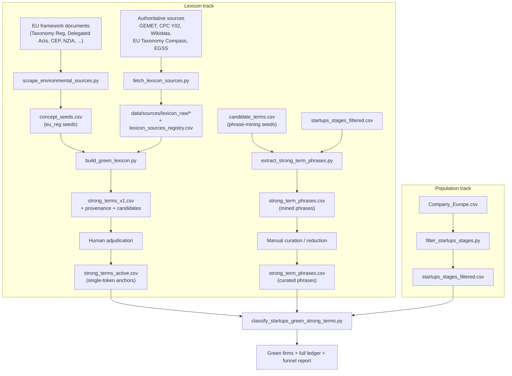
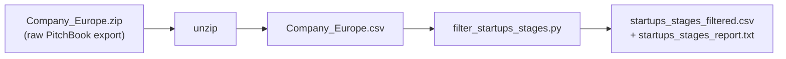
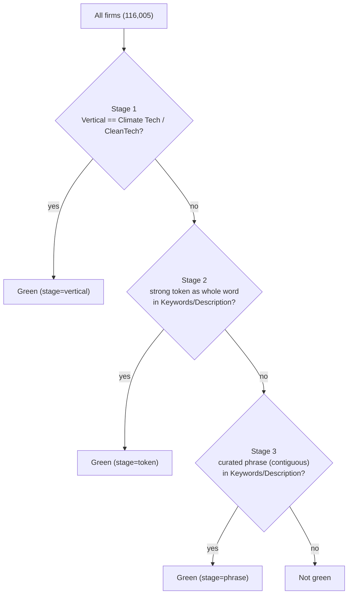

# Green Start-up Classification Pipeline

End-to-end description of how green start-ups are identified, from the raw
authoritative sources down to the final firm-level classification.

The pipeline has two independent tracks that meet at the classifier:

- **Lexicon track** - builds the controlled green vocabulary (single-token
  anchors and curated multi-word phrases) from authoritative sources.
- **Population track** - builds the start-up population from the raw PitchBook
  export.

The **classifier** consumes the lexicon plus the PitchBook `Verticals` field and
labels every firm through a sequential (cascading) rule.



---

## 0. Regulatory seed extraction (the `eu_reg` family)

**Script:** [scrape_environmental_sources.py](scrape_environmental_sources.py)

Builds `data/sources/concept_seeds.csv`, the pre-extracted regulatory seed
phrases consumed as the `eu_reg` family in Section 2. Same
download -> checksum -> deterministic-regex pattern as the other sources, applied
to the EU regulatory corpus.

1. **Download** official EU environmental framework documents (HTML/PDF) from a
   fixed source catalogue - e.g. Regulation (EU) 2020/852 (Taxonomy), the Climate
   and Environmental Delegated Acts, the Eurostat CEP classification, NZIA - into
   `data/sources/raw/`, computing a SHA-256 and recording each in
   `data/sources/manifest.csv`.
2. **Extract plain text** (`pypdf` for PDFs) into `data/sources/text/`.
3. **Apply explicit regex extractors (no LLM)** to the text:
   - `CEP_CODE_LABEL` - coded classification lines, e.g. `01 Protection of ambient
     air and climate`, `0402 Recycling`.
   - `ANNEX_ACTIVITY` - Taxonomy / Delegated-Act annex activity titles, e.g.
     `4.1. Electricity generation using solar ...`.
   - `CONCEPT_HEADING` - a fixed set of environmental concept phrases (climate
     change mitigation/adaptation, circular economy, pollution prevention,
     biodiversity, ecosystems, renewable energy, energy efficiency, carbon
     capture/removal/storage/farming, waste prevention/recycling/..., water
     reuse/efficiency/..., right to repair, ecodesign, net-zero).
   - `TECH_LIST_ITEM` - NZIA-style technology list items (solar, wind, geothermal,
     hydropower, heat pump, battery, electrolyser, carbon capture, grid, nuclear,
     biogas, biomethane, biofuel, ...).
4. **Dedupe** by `normalised_phrase` within each source; drop phrases shorter than
   4 characters and administrative boilerplate (`european union`,
   `official journal`, `european commission`, `member states`).

**Output:** `data/sources/concept_seeds.csv` (`seed_phrase`, `normalised_phrase`,
`source_id`, `source_url`, `objective_guess`, `extraction_rule`, `excerpt`).

---

## 1. Source acquisition

**Script:** [fetch_lexicon_sources.py](fetch_lexicon_sources.py)

Downloads every source "family" and archives the raw bytes with a SHA-256
checksum so the lexicon is byte-for-byte reproducible.

| Family | Class | Source | URL | Contribution |
|---|---|---|---|---|
| `gemet` | corroboration | GEMET SKOS thesaurus (EEA/Eionet) | https://www.eionet.europa.eu/gemet/exports/latest/gemet.rdf.gz | evidence only |
| `cpc_y02` | green-defining | CPC Y02/Y04S climate-mitigation patent taxonomy (USPTO) | https://www.uspto.gov/web/patents/classification/cpc/html/cpc-{Y02A,Y02B,Y02C,Y02D,Y02E,Y02P,Y02T,Y02W,Y04S}.html | can promote anchors |
| `wikidata` | green-defining | Wikidata green-tech subclasses (SPARQL, pinned query) | https://query.wikidata.org/sparql (query: `data/sources/lexicon_queries/wikidata_green_tech.rq`) | can promote anchors |
| `taxonomy_compass` | green-defining | EU Taxonomy Compass activities/sectors | https://webgate.ec.europa.eu/sft/api/v1/en/activities and https://webgate.ec.europa.eu/sft/api/v1/en/sectors | corroboration for atoms |
| `egss` | green-defining | EGSS compendium, Reg (EU) 2015/2174 (EUR-Lex, CELEX 32015R2174) | https://eur-lex.europa.eu/legal-content/EN/TXT/HTML/?uri=CELEX:32015R2174 (archived mirror: `data/sources/lexicon_raw/egss_2015_2174.txt`) | can promote anchors |
| `eu_reg` | corroboration | 16 archived EU regulatory texts (`concept_seeds.csv`) | see `data/sources/manifest.csv` (per-document URLs) | evidence only |

**Outputs:** `data/sources/lexicon_raw/*`, `data/sources/lexicon_sources_registry.csv`
(url, final_url, http_status, content_type, sha256, local path, fetched_at_utc,
license).

**`concept_seeds.csv` (the `eu_reg` family).** Unlike the other families, the EU
regulatory signal is not re-fetched here: it is supplied as pre-extracted,
normalised seed phrases drawn from the 16 archived EU regulatory texts. The
lexicon builder reads each row's `normalised_phrase`, tokenises it, and records
those tokens under the `eu_reg` family (and as multiword candidates). Because
`eu_reg` is corroboration-only, these seeds add statutory grounding and
provenance but never promote a token to an anchor on their own.

---

## 2. Lexicon build (single-token anchors)

**Script:** [build_green_lexicon.py](build_green_lexicon.py)

All labels are normalised (`normalise_phrase`: NFKC -> casefold -> non-word to
space -> collapse whitespace), tokenised, then filtered (alphabetic, length
>= 4, stopword and dual-use denylist removed). A cleaned token is **ACCEPTED**
as a strong anchor when it passes any one path:

- **Green atom** - it is the sole token of a whole label/name/alias in an
  atom-capable green-defining family (`cpc_y02`, `wikidata`, `egss`), e.g.
  `biofuels`, `agrivoltaics`.
- **Cross-source vote** - attested in >= 2 distinct green-defining families with
  a length/family threshold, e.g. `solar`, `photovoltaic`, `geothermal`.

A deterministic singular/plural variant is added for each accepted token.

**Outputs (data/outputs/):** `strong_terms_v1.csv` (accept pool),
`strong_terms_provenance.csv`, `strong_terms_candidates_review.csv`,
`strong_terms_multiword_candidates.csv`, `strong_terms_build_report.txt`.

---

## 3. Adjudication -> active anchor lexicon

The `strong_terms_v1.csv` accept pool is single-token voting over multiword
labels, so it is intentionally **not** activated automatically. It is reviewed
against explicit inclusion criteria (keep a token only if it denotes a green
technology/process on its own) and the kept tokens are written to:

- **[data/outputs/strong_terms_active.csv](data/outputs/strong_terms_active.csv)** - 68 curated single-token
  green roots (`token`, `n_families`, `source_families`, `accept_path`). This is
  the file the classifier consumes for the token stage.

---

## 4. Curated multi-word phrases

**Script:** [extract_strong_term_phrases.py](extract_strong_term_phrases.py)

Mines distinct multi-word PitchBook phrases that contain at least one seed term,
then lexically reduces them. A phrase is kept only if it passes, in order:

1. **Structural** - 2-4 words, no digits, every word > 3 letters after
   stopword-boundary trimming.
2. **Collocation gate** - minimum adjacent-bigram log-likelihood (Dunning G2)
   over the corpus `>= COLLOC_G2_MIN` (default 10.83). Curated keyword tags
   bypass this gate.
3. **POS gate** - the phrase is a noun-phrase pattern (adjectives / nouns /
   gerunds ending in a noun).

**Inputs:** `data/outputs/candidate_terms.csv` (the reviewed candidate token set
used as phrase-mining seeds; distinct from and broader on dual-use terms than the
active anchor set), `startups_stages_filtered.csv`.
**Output:** [data/outputs/strong_term_phrases.csv](data/outputs/strong_term_phrases.csv)
(`phrase`, `matched_terms`, `sources`, `n_tokens`, `firm_count`, `min_bigram_g2`).

> `candidate_terms.csv` is a manually-curated seed set (columns `token`,
> `n_families`, `source_families`, `accept_path`), not regenerated by a pipeline
> script. It is committed to the repo and must be present to run this step.

### Manual curation applied to the phrase list

After mining, the phrase list was reduced by hand to a defensible core (final
456 phrases):

- Sorted alphabetically by `phrase`.
- A parallel run excluding firms already tagged with a green vertical was
  produced (`strong_term_phrases_non_climate.csv`); phrases absent from that
  non-climate set were dropped from the working list (keeps phrases that stand on
  their own outside the Climate Tech / CleanTech population).
- **Redundancy reduction:** where a 2-word phrase exists, longer phrases (3-4
  words) that contain it as consecutive words were removed, keeping the shorter
  phrase; the same reduction was then applied with 3-word phrases against 4-word
  phrases.

---

## 5. Start-up population (how the start-up CSV is created)

The classifier's population file `startups_stages_filtered.csv` is produced from
the raw PitchBook export in two steps.



### Step 5.1 - Obtain the raw export

`Company_Europe.csv` is the raw PitchBook Academic Data Feed export for European
companies, unpacked from the archived `Company_Europe.zip`. Field definitions are
in `PitchBook Academic Data Feed - Data Dictionary.xlsx`.

```bash
unzip -o Company_Europe.zip        # -> Company_Europe.csv
```

> If the raw CSV is double-encoded (outer quote layer + `;;;;;;` row terminator
> + embedded newlines), run [clean_csv.py](clean_csv.py) first to reassemble it
> into RFC-4180 CSV (`startups_filtered.csv` -> `startups_cleaned.csv`, with
> unparseable rows routed to `startups_cleaned_errors.txt`). A clean
> `Company_Europe.csv` can be filtered directly.

### Step 5.2 - Four-stage filter

**Script:** [filter_startups_stages.py](filter_startups_stages.py)
(`INPUT_PATH = Company_Europe.csv` -> `OUTPUT_PATH = startups_stages_filtered.csv`).

Stages are applied **in order**; a row must pass stage *n* to be considered for
stage *n+1*. Reading is parallelised with pyarrow when available, otherwise it
streams with pandas in 200k-row chunks.

| Stage | Rule | Kept when | Dropped |
|---|---|---|---|
| 1 Young | age = `2026 - YearFounded` | `YearFounded` present and age `<= 10` | missing/invalid year, or too old |
| 2 Ownership | `OwnershipStatus` allow-list | Privately Held (no backing) / (backing) / In IPO Registration | everything else incl. Out of Business |
| 3 Universe | `Universe` allow-list | >= 1 token and **all** tokens in {Pre-venture, Venture Capital, Private Equity, Debt Financed} | any M&A / Publicly Listed / Other Private Companies / empty |
| 4 Alive | `BusinessStatus` | not in {Out of Business, Bankruptcy: Liquidation, Bankruptcy: Admin/Reorg} | defunct/bankrupt (empty is kept = unknown) |

An `age_years` column is added to survivors. Per-stage kept/dropped counts and the
top rejection reasons are written to `startups_stages_report.txt`.

```bash
python filter_startups_stages.py   # Company_Europe.csv -> startups_stages_filtered.csv
```

**Output:** `startups_stages_filtered.csv` - 116,005 firms with the PitchBook
fields used downstream (`CompanyID`, `CompanyName`, `Keywords`, `Description`,
`Verticals`, `age_years`, ...).

---

## 6. Sequential classification

**Script:** [classify_startups_green_strong_terms.py](classify_startups_green_strong_terms.py)

A cascading rule in a fixed order. Each firm is captured by the **first** stage
that fires, then removed from the pool, so each stage reports its *incremental*
contribution. Matching is case-insensitive and punctuation-insensitive
(`normalise_phrase`); no stemming or fuzzy matching.



| Stage | Signal | Matching rule | Source file |
|---|---|---|---|
| 1 | Vertical | exact comma-split tag == `Climate Tech` / `CleanTech` | `Verticals` field |
| 2 | Strong token | strong root as a whole word in Description or in any Keyword tag | `strong_terms_active.csv` |
| 3 | Curated phrase | phrase as a contiguous whole phrase in Description or in any single Keyword tag | `strong_term_phrases.csv` |

Each firm receives one `GreenStage` value (`vertical` | `token` | `phrase` |
`none`) plus per-stage match columns.

**Outputs (data/outputs/):**

- `startups_to_green_startups_strong_terms.csv` - green firms only + audit
  columns (`Green`, `GreenStage`, `GreenVerticalMatches`, `GreenTokenMatches`,
  `GreenPhraseMatches`).
- `startup_population_green_classification_strong_terms.csv` - full 116,005-row
  ledger.
- `green_classification_strong_terms_report.txt` - per-stage funnel.

### Latest run results

| Stage | Signal | Pool in | New green | Cumulative | Remaining |
|---|---|---:|---:|---:|---:|
| 1 | Vertical | 116,005 | 6,636 | 6,636 | 109,369 |
| 2 | Strong token | 109,369 | 1,262 | 7,898 | 108,107 |
| 3 | Curated phrase | 108,107 | 800 | 8,698 | 107,307 |

**Green total: 8,698** (7.5% of population). Not green: 107,307.

Because the cascade is ordered, a firm with both a green vertical and a strong
token is attributed only to `vertical`; the funnel reflects each stage's
incremental contribution in the order Vertical -> token -> phrase.

---

## 7. How to run the full pipeline

### 7.0 Prerequisites

- **Python 3.12+.** Source fetching needs network access; phrase mining needs the
  `nltk` POS tagger. The final classifier is pure string matching and needs
  neither.
- **Python packages:** `pandas`, `pyarrow` (optional, faster population filter),
  `nltk` (phrase POS gate), `pypdf` (regulatory seed extraction). If the
  interpreter lacks the stdlib `sqlite3` (which `nltk` imports), install a drop-in
  such as `pysqlite3-binary`.
- **Input files that must be present** (not all are in the repo):
  - `Company_Europe.zip` / `Company_Europe.csv` - raw PitchBook export (obtain
    separately; gitignored).
  - `data/sources/` - lexicon raw sources + `concept_seeds.csv` + pinned Wikidata
    query (needed only if you rebuild the lexicon from scratch; large, so kept out
    of the repo).
  - `data/outputs/candidate_terms.csv` - phrase-mining seeds (committed).

If you only want to (re)classify with the committed lexicon, you can skip the
lexicon track (7.1) and run only the population and classification steps
(7.2 and 7.3), because `strong_terms_active.csv` and `strong_term_phrases.csv`
are committed.

### 7.1 Lexicon track

```bash
# 0. Extract regulatory seed phrases (eu_reg family)
python scrape_environmental_sources.py     # -> data/sources/concept_seeds.csv (+ raw/, text/, manifest.csv)

# 1. Fetch + checksum the other source families
python fetch_lexicon_sources.py            # -> data/sources/lexicon_raw/*, registry

# 2. Build the single-token anchor pool
python build_green_lexicon.py              # -> data/outputs/strong_terms_v1.csv (+ provenance, candidates)

# 3. Adjudicate (manual): review strong_terms_v1.csv / candidates and write the
#    kept single tokens to data/outputs/strong_terms_active.csv

# 4. Mine curated multi-word phrases (seeded by candidate_terms.csv)
python extract_strong_term_phrases.py      # -> data/outputs/strong_term_phrases.csv
```

Step 4 also supports excluding firms already tagged with a green vertical (writes
`strong_term_phrases_non_climate.csv`) - used during manual curation.

#### 4a. Manual phrase curation (reproduces the committed 456-phrase list)

Applied in this order (see Section 4 for rationale):

```bash
# 1. Non-climate filter: re-run step 4 with green-vertical firms excluded (writes
#    strong_term_phrases_non_climate.csv), then drop from the working list any
#    phrase absent from that non-climate set.

# 2. Sort alphabetically by phrase
python3 -c "import csv;p='data/outputs/strong_term_phrases.csv';\
rows=list(csv.reader(open(p)));h=rows[0];d=sorted(rows[1:],key=lambda x:x[0].casefold());\
csv.writer(open(p,'w',newline='')).writerows([h]+d)"

# 3. Redundancy reduction: drop longer phrases that contain a shorter kept phrase
#    (2-word phrases vs 3-4 word; then 3-word vs 4-word), keeping the shorter form.
```

### 7.2 Population track

```bash
unzip -o Company_Europe.zip                # -> Company_Europe.csv (raw PitchBook export)
# (optional) python clean_csv.py           # only if the raw CSV is double-encoded
python filter_startups_stages.py           # -> startups_stages_filtered.csv (+ report)
```

### 7.3 Classification

```bash
python classify_startups_green_strong_terms.py
# -> data/outputs/startups_to_green_startups_strong_terms.csv
# -> data/outputs/startup_population_green_classification_strong_terms.csv
# -> data/outputs/green_classification_strong_terms_report.txt
```

---

## 8. Caveats

- **Whole-word token matching is broad by design.** Dual-use roots present in
  the active set (`biological`, `nuclear`, `disposal`, ...) pull in some
  non-obvious firms. `GreenStage` and the per-stage match columns make this
  auditable.
- **Operational environmental-relevance, not legal Taxonomy alignment** of
  individual companies.
- **Reproducibility** is pinned by `lexicon_sources_registry.csv` (source
  SHA-256s); any source refresh is a new lexicon version.
