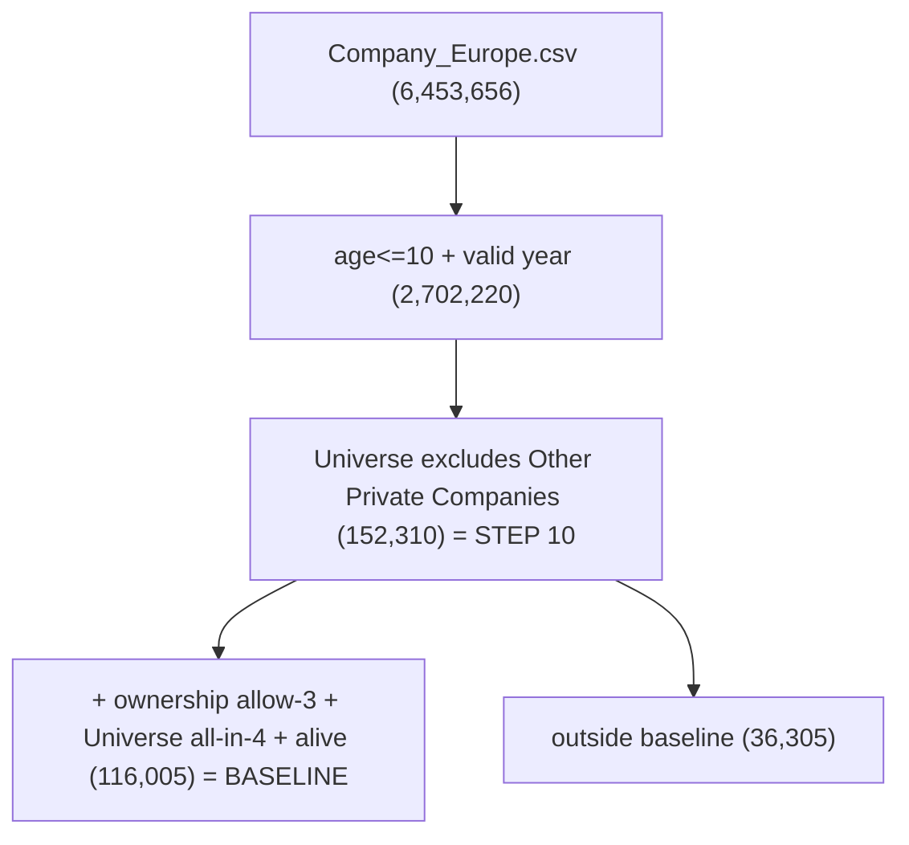

# Step 10 - Expanded Start-up-Status Population (supplementary sensitivity)

A strictly **read-only**, additive exercise that reconstructs a broader
observable population of young European firms - including firms that have since
been **acquired/merged, gone public, or ceased operating** - so the 2026
baseline's "surviving start-ups only" limitation can be assessed. It answers the
supervisor's concern that the baseline observes firms that *still* satisfy the
start-up definition in 2026, but not the firms that "ever were a start-up and are
not anymore".

It does not replace the 116,005 baseline and does not rerun Steps 3-8.

## The two definitions

BASELINE (existing, 116,005):
- Europe AND valid `YearFounded` AND `age <= 10`
- AND `OwnershipStatus` in {Privately Held (no backing), Privately Held (backing), In IPO Registration}
- AND every `Universe` token in {Pre-venture, Venture Capital, Private Equity, Debt Financed}
- AND `BusinessStatus` not in {Out of Business, Bankruptcy: Liquidation, Bankruptcy: Admin/Reorg}

STEP 10 EXPANDED (152,310):
- Europe AND valid `YearFounded` AND `age <= 10` (identical age criterion)
- AND `Universe` does NOT contain `Other Private Companies` (equivalently, every token in the
  permitted 6: Pre-venture / Venture Capital / Private Equity / Debt Financed / M&A / Publicly Listed)
- NO current-ownership restriction
- NO operating-business-status restriction

The baseline is a strict subset of the expanded population, so **outside-baseline = 36,305**.



## Why each firm is outside the baseline

Every outside-baseline firm fails at least one of the three baseline filters; each
is computed independently (a firm can fail several) so the reason is traceable:
- `fails_ownership` - OwnershipStatus not in the baseline allow-3 (i.e. Acquired/Merged,
  Publicly Held, or Out of Business).
- `fails_universe` - Universe contains `M&A` or `Publicly Listed`.
- `fails_alive` - BusinessStatus in {Out of Business, Bankruptcy: Liquidation, Bankruptcy: Admin/Reorg}.

Raw status flags (from the actual PitchBook values; nothing invented -
PitchBook records acquired and merged as a single `Acquired/Merged` value):
`has_ma_universe`, `has_publicly_listed_universe`, `is_acquired_or_merged`,
`is_public_owner`, `is_public`, `is_out_of_business`, `is_out_of_business_owner`,
`is_bankruptcy`, `is_other_nonoperating`.

The raw flags are primary. A single mutually-exclusive `baseline_exclusion_group`
is provided for tables only: `baseline_2026`, `out_of_business_or_bankrupt`,
`acquired_or_merged`, `public_or_exited`, `universe_exit_marker_only` (still
private and operating, excluded only by an M&A/Publicly Listed Universe token),
`multiple_exit_statuses`, `other`.

## Green classification

The existing methodology is applied unchanged (Stage 1 vertical + Stage 2 tokens +
Stage 3 phrases) via `classify_startups_green_strong_terms.py`. On-disk vocabulary
is 68 tokens / 456 phrases (the thesis quotes 64/458; recorded in the audit).

Green labels are assigned **hybrid**: baseline firms take the canonical
`green`/`green_stage` from `population_key.parquet` (so the baseline reconciles to
exactly 8,306 green / 107,699 other); the 36,305 outside-baseline firms get
freshly-applied classifier labels. A `green_applied`/`green_stage_applied` column
is emitted for all firms for QA, and canonical-vs-applied drift on the baseline is
reported in the audit.

## Outputs (`data/outputs/chapter4/`)

- `step10_expanded_population.parquet` - 152,310 rows: IDs, founding year/age/cohort,
  raw OwnershipStatus/BusinessStatus/Universe, all raw flags, the exclusion
  decomposition, green + green_stage (hybrid) and green_applied, membership/group.
- `T_status_population_flow.csv` - expanded -> baseline vs outside, then the outside
  groups; columns total_n, green_n, other_n, green_share_pct.
- `T_status_outcomes_green_vs_other.csv` - membership + exit-group composition, green
  vs other columns, plus the share of each cohort still in the baseline.
- `T_status_exclusion_green_vs_other.csv` - **outside-baseline firms only**, green vs
  other across the exclusion criteria (the three baseline filters, the non-exclusive
  raw flags, and the exclusive groups). Columns: all-outside, green start-ups, other.
- `T_status_outcomes_by_cohort.csv` - the same status composition by founding cohort
  (2016-2018 / 2019-2021 / 2022-2024 / 2025-2026), to separate exit differences from
  green firms simply being older.
- `step10_universe_diagnostics.csv` - raw Universe/Ownership/Business value counts on
  the age-filtered population, flagged for Other Private Companies and Step 10 retention.
- `step10_audit.csv` - reconciliations, duplicate checks, read-only assertion.
- `step10_expanded_status_report.txt` - the module's own human-readable report.

## Run

Heavy read (5.4 GB source). On turin003:

```
module load python/3.12.13-aocl5.3
python -m empirical_analysis.step10_expanded_status.build
```

Custom input locations via CLI flags (or env vars `KWR_STEP10_SOURCE`,
`KWR_POPULATION`, `KWR_STANDALONE`, `KWR_PHRASES`, `KWR_OUT_DIR`):

```
python -m empirical_analysis.step10_expanded_status.build \
  --source /path/to/Company_Europe.csv \
  --population /path/to/population_key.parquet \
  --standalone /path/to/strong_terms_active.csv \
  --phrases /path/to/strong_term_phrases.csv \
  --out-dir /path/to/outputs
```

## Interpretation boundary (crucial)

This is a **current-snapshot** (7 July 2026 extract) status composition, not a
survival panel. It identifies firms in the current database that appear to have
transitioned out of the baseline through failure, M&A, public listing or related
statuses, but it cannot reconstruct every firm that was historically a start-up or
estimate the timing/probability of survival. Firms founded more than 10 years ago,
or purged from PitchBook entirely, are not recovered.

Use the terms: "expanded start-up-status population", "status sensitivity",
"observable firms outside the 2026 baseline", "current exit/non-operation status".
Avoid: "historical start-up population", longitudinal "survival rate", "failure
rate", or any causal claim that green firms survive better/worse. The output can
nevertheless show whether green and other firms have different observed current-status
compositions, which is what informs how serious the 2026 snapshot limitation may be.
